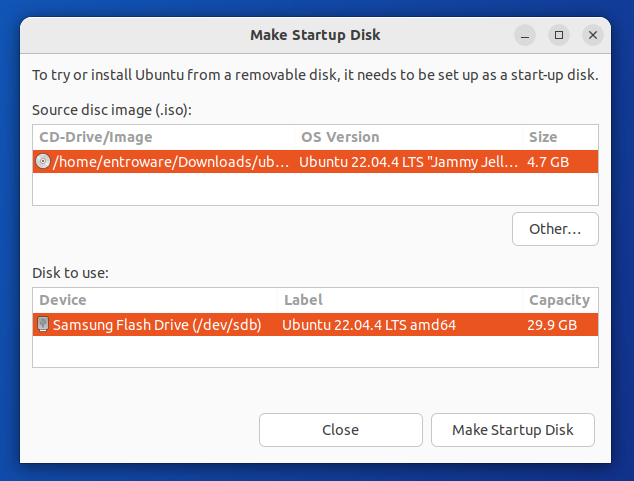
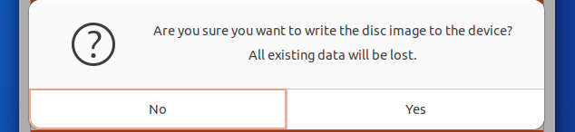
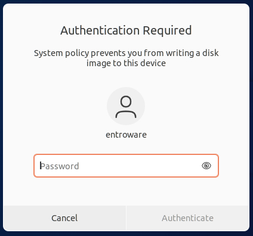
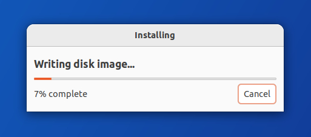

### Part 1 - Prerequisites

Before you get started you will need to make sure that you have a USB storage drive that is at least 8GB in capacity.  It is important to note that the USB storage drive will be erased during the creation process so we would highly recommend backing up any data you want to keep.

### Part 2 - Getting the ISO

Head over to the [Ubuntu download page](https://ubuntu.com/download) and download the latest LTS (Long Term Support) release.

This will download an ISO disk image file with a filename similar to `ubuntu-24.04-desktop-amd64.iso`.

### Part 3 - Prepare the disk creator

Open the `Startup Disk Creator` application that is comes with Ubuntu by default.  You can then select your downloaded Ubuntu ISO from Part 2, and then select your USB drive.

The image below shows that in our example we selected an Ubuntu 22.04.4 ISO and we are about to use a Samsung Flash Drive.

### Part 4 - Image the USB drive

You can now select `Make Startup Disk` and you will be prompted to confirm the erasure of the selected USB drive.  

Once confirmed you will then be asked to enter your user account password and the creation process will begin.

### Part 5 - Sit back and wait

After your password is accepted the Startup Disk Creator will write the content of the ISO file to your USB drive.  This process make take a few minutes to complete and the speed will be dependant on how fast your USB drive is.

Once completed you will now be able to boot from the USB device at system startup.

