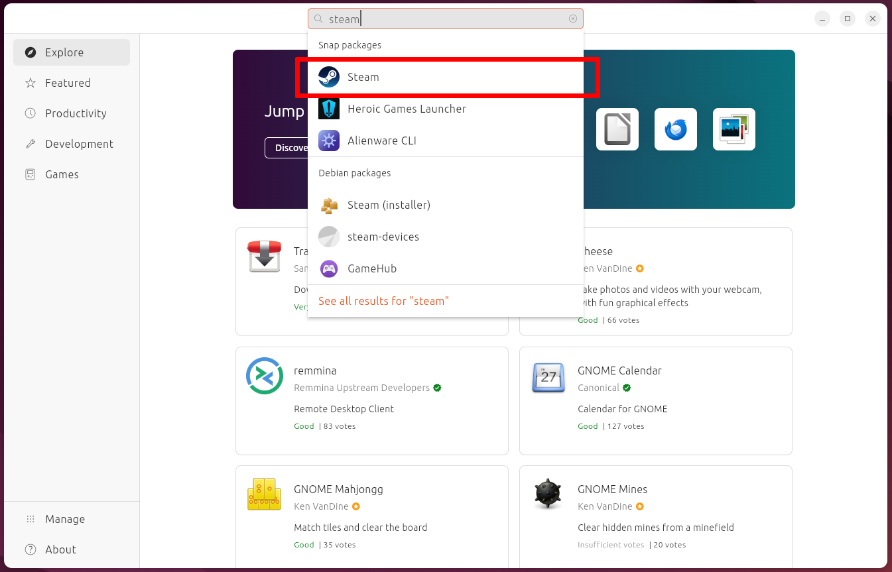
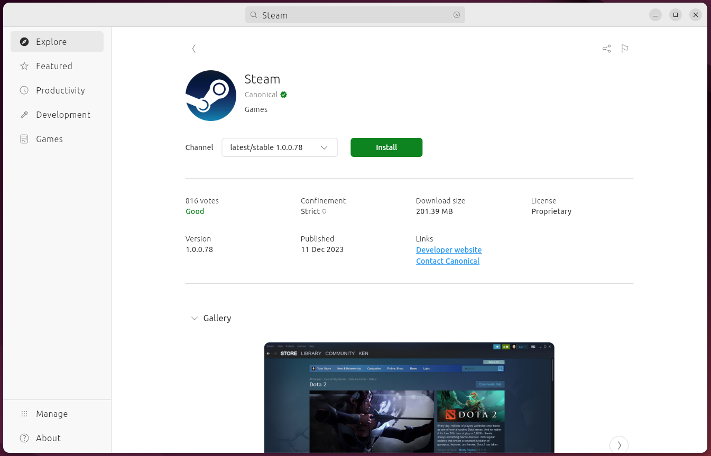
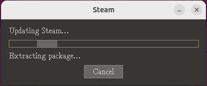
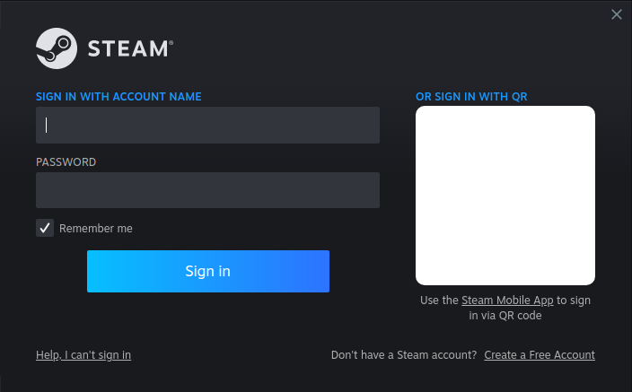

## Introduction to Steam
Steam is a game distribution platform developed by Valve. It provides users with easy game installation, automatic updating, as well as cloud storage for game saves.  There are also community features such as friends, groups, and news.


### Install Option 1 - Installing Steam using the App Center

Open the preinstalled `Ubuntu Software` application and search for `steam`.  Then click on the menu item titled `Steam` with the Steam logo to the left similar to the image below.



Then click the `Install` button on the Steam application page.  The correct page should also display `Canonical` with its verified badge as its publisher.




### Install Option 2 - Installing Steam using a terminal

Open a terminal and enter the following command
```bash
user@machine:~$ sudo snap install steam
```
The steam application is now installed.

### Launch Steam

Now you're ready to launch Steam and log in.  On first launch you will see window similar to the image below for a few moments while Steam downloads its remaining files and gets set up.



After that has completed you will then be able to login and play your favourite Linux compatible games.




