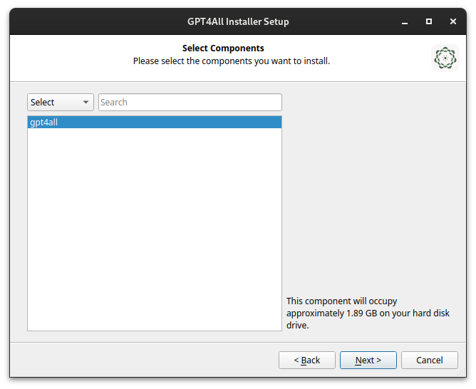
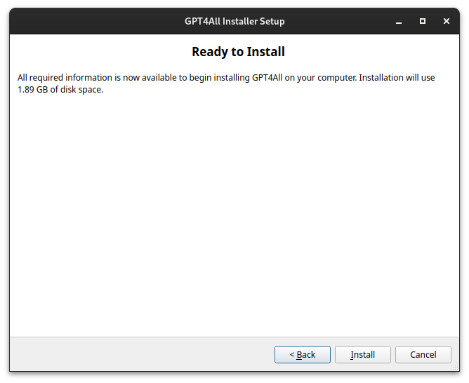

## Introduction to GPT4ALL

GPT4ALL is a useful tool developed by Nomic AI, for running and interfacing with LLMs (Large Language Models) without relying on cloud-based services, offering significant advantages in terms of privacy, data security, and offline functionality.

Unlike cloud-based AI services, GPT4ALL allows for processing on your Entroware hardware, ensuring that your sensitive information never leaves your computer.

GPT4ALL supports a variety of models with different capabilities, sizes, and performance characteristics, allowing you to choose the right balance for your specific hardware configuration and use case.

In this article we will explain how to install GPT4ALL on your Ubuntu computer and explore how to select and use a language model (in this case DeepSeek R1) to solve a Python coding problem. 


## Installing GPT4ALL

Follow these  steps to install GPT4ALL on your Ubuntu system:

1. First, open a terminal (Ctrl+Alt+T) and download the GPT4ALL installer for Linux.
```bash
wget https://gpt4all.io/installers/gpt4all-installer-linux.run
```


2. Give the installer executable permissions.
```bash
chmod +x gpt4all-installer-linux.run
```


3. Start the installer.
```bash
./gpt4all-installer-linux.run
```


4. You will then be asked to specify an installation directory for GPT4ALL. We would recommend leaving this as the default, however if you choose a custom location, make note of it for later on and click `Next` to continue.


5. The installable components will be displayed, as well as the required disk space (in this case *1.89 GB*). If you are happy with this click `Next` to proceed.




6. Carefully read Nomic's Licence Agreement. Once you understand and accept the terms, proceed to the next step.


7. Finally you can click `Install` to begin the installation process. This may take several minutes depending on your internet connection and system performance.




## Using GPT4ALL

#### Setting up GPT4ALL to use DeepSeek R1


1. You can now launch GPT4ALL using the the directory we specified during the install process.
```bash
./gpt4all/bin/chat
```

2. When GPT4ALL loads for the first time, you'll see a welcome screen asking if you want to opt in to analytics to help Nomic make improvements.  If you do not wish to do this just select *No* for both options in the bottom right.


3. Click on the `Models` tab in the left sidebar to view currently installed models. Initially, this list may contain only a basic model. In this example we will be installing the DeepSeek R1 model, so to do this click on `Add Model` in the top right.


4. Scroll down to find the DeepSeek R1 model and click `Download`. This will then be downloaded and made available on your system.


#### Start Chatting


1. Now that we have the new model installed we can click on `Chats` in the left side menu. At the top you can select the DeepSeek R1 model to interact with.


2. You can now begin interacting with the model. Type your questions or requests in the input field at the bottom of the screen. In this example we will ask it how to fix a mistake in a python function.


## Conclusion

Congratulations! You should now be up and running and ready to experiment with GPT4ALL and a language model of your choosing, all running locally on your Entroware hardware. You should also have the knowledge to set up and use different models, including DeepSeek R1, and apply them to a problem. Feel free to experiment with different models, prompts, and phrasing to yield different results, which may be more suitable for your use case.


