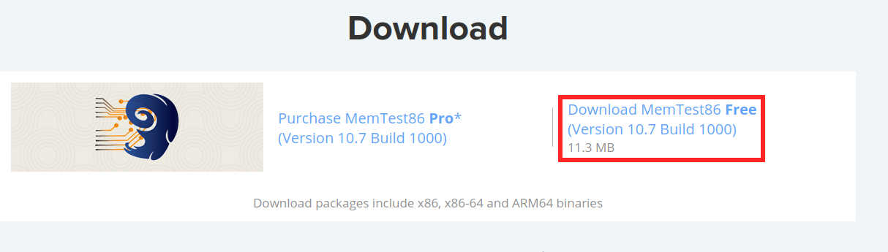
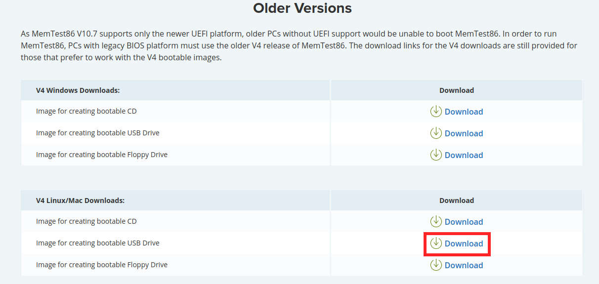
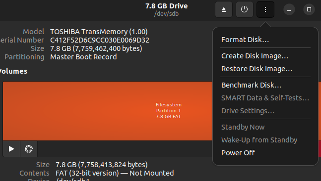
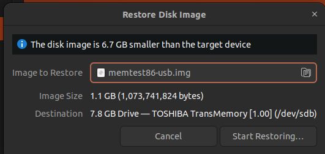
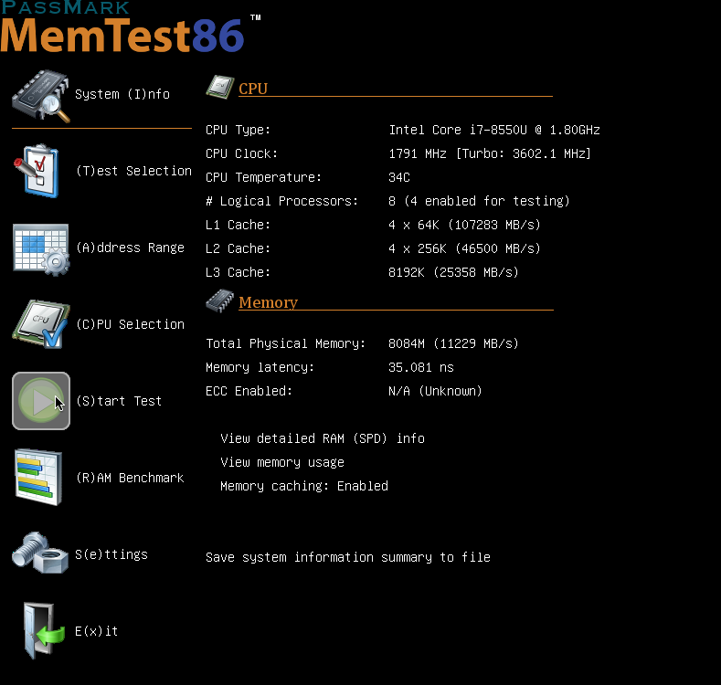
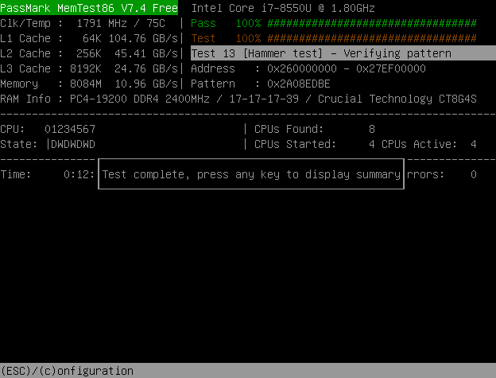
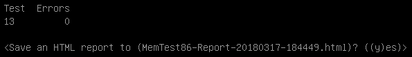

## Introduction to Memtest86

Memtest86 is a tool used to diagnose issues with memory (RAM). It is not a part of the operating system and must be booted into to perform a test. Testing memory is a very important diagnostic step when the user is experiencing errant behaviour from their computer, because memory failures can manifest in completely erratic and unpredictable ways which may make other tests impossible. This guide will teach you how to create a bootable Memtest86 USB drive and use it to test your computer's memory.

### Getting Started

To create a Memtest86 bootable USB drive, you will need:
1. USB Drive: Minimum 2GB capacity recommended
2. Memtest86 Image: Downloaded from the memtest86 website

To download the image, go to www.memtest86.com/download.htm

#### UEFI systems:
Download Memtest86 Free from the top of the page.

#### Legacy systems:
Scroll down to Older Versions, under the *V4 Linux/Mac Downloads* heading, download the *Image for creating bootable USB Drive*.

### Extract Memtest86 USB disk image

Open the newly downloaded `memtest86-usb.zip` zip file and extract the `memtest86-usb.img` file from the archive.  This file will be used in the next step.

### Creating a bootable Memtest86 USB drive

1. Open the Disks application and select your USB drive from the side menu. 

2. Click on the three dots once again and select `Restore Disk Image...`

3. Under Image to Restore, choose the extracted 'memstest86-usb.img' from earlier and click `Start Restoring...`

Click `Restore` on the next window to finish imaging the drive.

Finally, shut down your system to proceed to the next stage.

### Using Memtest86

1. Ensure AC is connected, power machine on and press your boot key (F7 on Entroware laptops, F8 or F12 on Entroware desktops). 
From the boot menu, select the removable drive and press enter.

2. Once memtest86 has loaded, select 'Config'

3. To begin testing your system's memory, select the 'Start Test' option on the left.

4. Memtest86 will now thoroughly test the memory installed in your computer. This may take many hours to complete depending on many variables, but will provide crucial insight into the condition of your memory modules.

5. Once the test has been completed, you will be prompted to press any key to view the results.

6. Memtest86 will then display the number of errors that have been found (if any). You will also be asked if you wish to save a report to a file on the USB drive, select 'y'.

### Conclusion
This article has guided you through the creation and use of a memtest86 usb drive to test the memory modules in your computer.  If you find memory errors and are within warranty or have an SLA, contact us for memory replacement options. If you are self-servicing, have suitable experience and have taken the proper precautions, ensure the failing memory module(s) have been properly identified in multi module setups by rerunning the test with each module removed.
